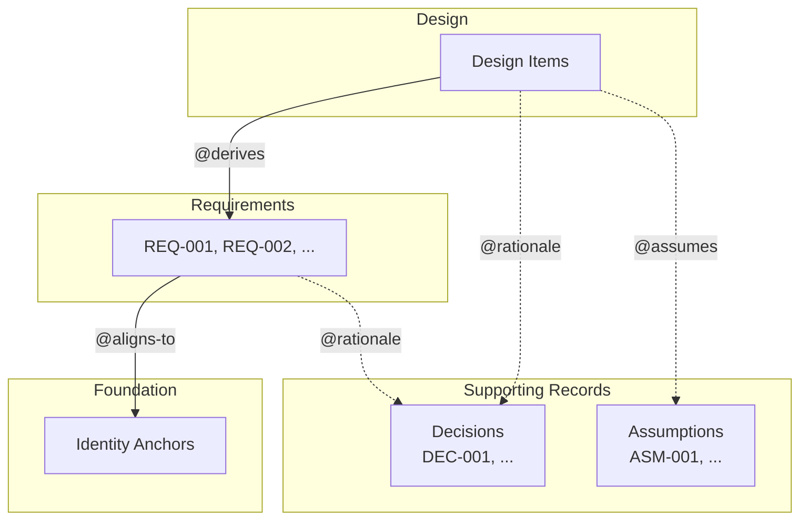
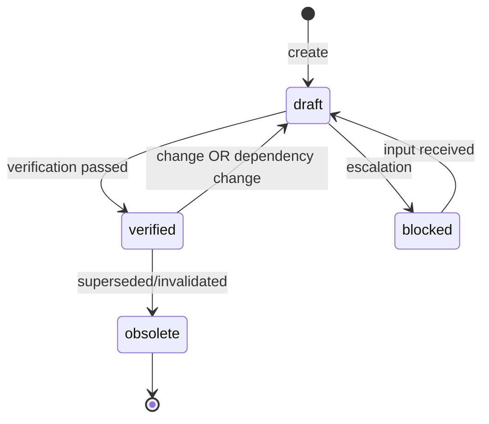
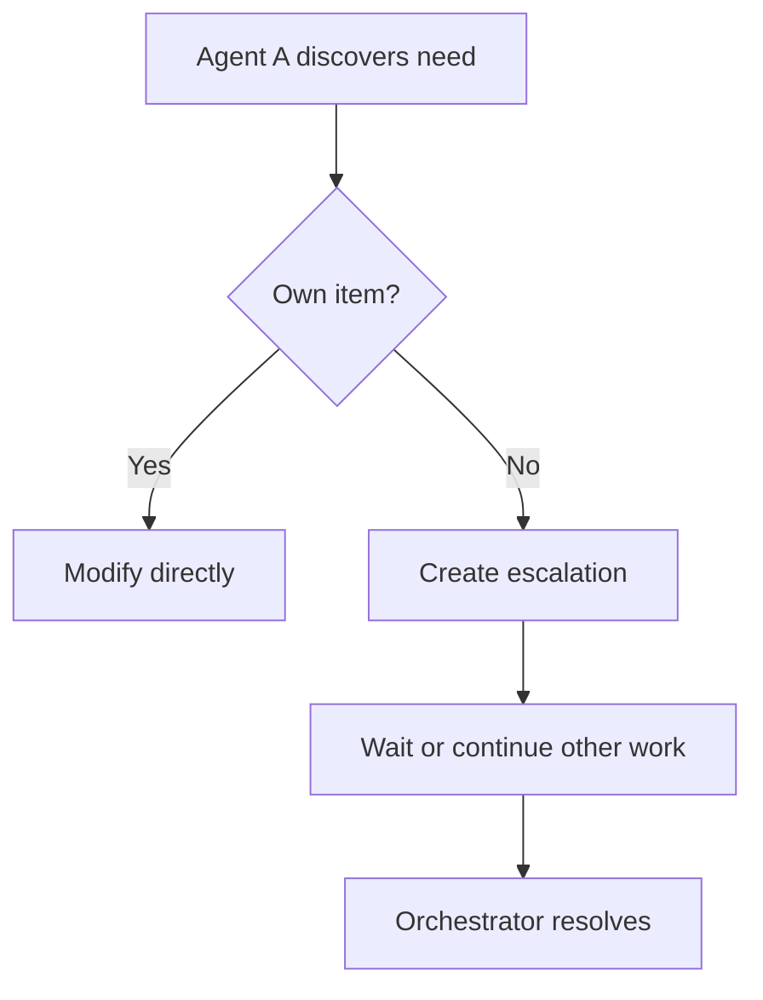
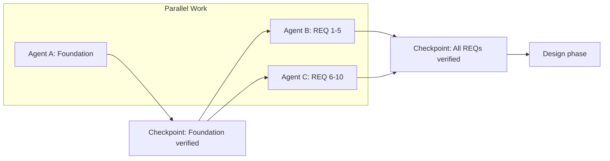

# Spec-Driven Development: Guidelines

> Structural rules for applying the framework. For concrete formats and procedures, see Practice.

---

## Overview

### Artifact Relationships



### Section Map

| Section | Philosophy Source | Purpose |
|---------|-------------------|---------|
| 1. Artifacts | Definition (Existence + Decision) | What to create |
| 2. Traceability | Definition (Existence + Decision) | How to link |
| 3. Verification | Conditions (Verifiability) | How to check and respond |
| 4. State | Observer + Conditions | What to track |
| 5. Change | Continuity | How to propagate |
| 6. Recovery | Recovery | How to restore |
| 7. Subsystems | (Structural) | How to scale |
| 8. Versioning | Continuity | How to track evolution |
| 9. Customization | (Practical) | How to adapt |
| 10. Multi-Agent | Observer + Continuity | How to coordinate |
| 11. Example | (Practical) | Concrete illustration |

---

## 1. Artifacts

Three artifact types externalize different aspects of a system. Supporting records (Decisions, Assumptions) attach to these artifacts via links.

### 1.1 Foundation

**Purpose:** Defines identity — what this system is.

**Characteristics:**
- Freeform structure
- Stable over time
- Reference point for alignment
- One per system/subsystem

**Must answer:**
- What are we building?
- What defines its identity?
- What's in scope and out of scope?

#### Identity Anchors

Identity Anchors enable traceable alignment from Requirements.

```markdown
## Identity Anchors

- **SCOPE-MOBILE:** Mobile-first, portrait mode only
- **SCOPE-SESSION:** 10-minute play sessions max
- **TONE-HUMOR:** Dark humor, no explicit violence
- **CONSTRAINT-OFFLINE:** Must work offline after initial load
```

**Anchor rules:**
- Use consistent prefix: `SCOPE-`, `TONE-`, `CONSTRAINT-`, `DECISION-`
- Keep each anchor to one clear statement
- Anchors can appear anywhere in Foundation; dedicated section optional

---

### 1.2 Requirements

**Purpose:** Defines success criteria — what the system must satisfy.

**Characteristics:**
- Structured with unique identifiers
- Each independently verifiable
- Aligned to Foundation
- Implementation-agnostic

**Must answer:**
- What behaviors are required?
- What constraints must be met?
- How do we verify it's correct?

**ID Conventions:**

| Type | Pattern | Example |
|------|---------|---------|
| Functional | `REQ-{NNN}` | REQ-001 |
| Non-functional | `REQ-NF-{NNN}` | REQ-NF-001 |
| Domain-grouped | `REQ-{DOMAIN}-{NNN}` | REQ-AUTH-001 |

---

### 1.3 Design

**Purpose:** Defines implementation — how to build it.

**Characteristics:**
- Every item traceable to Requirements
- Structure varies by project
- Includes rationale for non-obvious choices

**Must answer:**
- How will we build this?
- Why this approach over alternatives?

---

### 1.4 Supporting Records

Supporting records externalize reasoning and assumptions. They are not artifacts themselves but attach to artifacts via links.

#### Decisions (DEC-NNN)

**Purpose:** Externalizes reasoning — why choices were made.

> Philosophy v5 §2.2: "A system can have perfect existence links yet lose integrity if decision reasoning is lost."

**When required:** Every non-obvious choice must have externalized reasoning.

| Non-obvious (rationale required) | Obvious (no rationale needed) |
|----------------------------------|-------------------------------|
| Alternatives exist | No realistic alternative |
| Trade-off involved | Direct mapping from requirement |
| Future risk from assumption | Industry standard practice |
| Reviewer would ask "why?" | Self-evident |

**Format by significance:**

| Significance | Format | When |
|--------------|--------|------|
| High | Separate file (DEC-NNN.md) | Architecture, technology selection, major trade-offs |
| Medium | Inline `@rationale` block | Component-level decisions |
| Low | Inline `@rationale` comment | Minor choices |

**Decision record must capture:**

| Element | Question |
|---------|----------|
| Choice | What was decided? |
| Alternatives | What was rejected? |
| Rationale | Why this choice? |
| Impacts | What does this affect? |

**Location:** `spec/decisions/DEC-NNN.md`

#### Assumptions (ASM-NNN)

**Purpose:** Tracks conditions assumed to be true that could invalidate work if false.

**When to formalize:** Create ASM-NNN record when assumption is high-risk:

| High-risk (formal ASM-NNN) | Low-risk (inline `@assumes`) |
|----------------------------|------------------------------|
| Invalidation would require rework | Invalidation is minor adjustment |
| Depends on external factor | Internal implementation detail |
| Multiple items share assumption | Single item affected |
| Uncertain confidence | High confidence |

**Assumption record must capture:**

| Element | Question |
|---------|----------|
| Assumption | What we assume true |
| Basis | Why we believe it |
| Risk | What if wrong |
| Invalidation triggers | Conditions that would falsify |

**Location:** `spec/assumptions/ASM-NNN.md` or inline with `@assumes`

---

## 2. Traceability

Link types establish traceability chains.

### 2.1 Link Requirements

| Link | From | To | Required |
|------|------|----|----------|
| `@aligns-to` | Requirement | Foundation anchor | **Yes** |
| `@derives` | Design | Requirement | **Yes** |
| `@rationale` | Any | Decision/reasoning | **Yes** for non-obvious |
| `@assumes` | Any | Assumption | When applicable |
| `@invalidated-by` | Assumption | Condition | When applicable |
| `@supersedes` | Decision | Prior Decision | When replacing |

### 2.2 Link Syntax

**In Requirements:**

```markdown
## REQ-005: Rate Limiting

API must enforce per-key rate limits.

`@aligns-to:` CONSTRAINT-FAIR-USE
```

**In Design:**

```markdown
## Token Bucket Algorithm

Rate limiting uses token bucket with configurable RPM.

`@derives:` REQ-005
`@rationale:` Chose token bucket over sliding window — O(1) memory per key 
              vs O(n) for sliding window. Critical for 10K+ concurrent keys.
`@assumes:` ASM-002 (single-region deployment)
```

**Reference formats:**
- Same document: `#section-anchor` or `ID`
- Other document: `./path/to/doc.md#anchor`
- Identity Anchor: `SCOPE-MOBILE`, `CONSTRAINT-OFFLINE`
- Requirement: `REQ-005`, `REQ-AUTH-001`
- Decision: `DEC-003` or `./decisions/DEC-003.md`
- Assumption: `ASM-002` or inline text

---

## 3. Verification

### 3.1 Verification Types

| Type | Question | Method |
|------|----------|--------|
| **Alignment** | Do requirements serve the foundation? | Heuristics (qualitative) |
| **Traceability** | Is every design item justified? | Link verification (mechanical) |
| **Consistency** | Do artifacts contradict each other? | Mixed |

### 3.2 Alignment Check (Foundation ↔ Requirements)

**Heuristics:**

| Check | Pass | Fail |
|-------|------|------|
| Coverage | Every anchor has ≥1 requirement | Anchor unaddressed |
| Scope | Requirement within Foundation scope | Outside scope |
| Non-contradiction | Consistent with constraints | Violates constraint |
| Terminology | Uses Foundation's terms | Conflicting terms |

### 3.3 Traceability Check (Requirements ↔ Design)

**Mechanical checks:**

| Check | Method |
|-------|--------|
| `@derives` exists | Parse each design item |
| `@derives` target exists | Lookup REQ-ID |
| `@rationale` exists | Check non-obvious items |

**Depth criteria for "implements target":**

| Depth | Meaning | When to use |
|-------|---------|-------------|
| Addresses | Design item relates to requirement | Draft phase |
| Satisfies | Design item fully covers requirement | Verified phase |
| Testable | Acceptance criteria defined and passable | Pre-implementation |

### 3.4 Consistency Check

| Check | Vertical | Horizontal |
|-------|----------|------------|
| Non-contradictory | No conflict with source | No conflict with siblings |
| Terminology | Uses source's terms | Consistent with siblings |

### 3.5 Verification Triggers

| Point | Trigger | What to Verify |
|-------|---------|----------------|
| Requirements Complete | All REQs drafted | Alignment |
| Design Complete | All design items drafted | Traceability |
| Pre-Implementation | Before coding | Full consistency |
| Post-Change | After artifact modified | Affected items only |

### 3.6 Handling Verification Results

#### Pass

- Update item status to `verified`
- Record verification timestamp
- Proceed to next item

#### Fail — Self-Resolvable

Resolve without escalation when:

| Failure | Condition | Action |
|---------|-----------|--------|
| Missing `@derives` | Target clearly exists | Add link |
| Missing `@aligns-to` | Anchor clearly exists | Add link |
| Terminology inconsistency | Meaning unambiguous | Standardize |
| Missing `@rationale` | Choice is actually obvious | Document as obvious |

After resolution: re-verify, then mark `verified`.

#### Fail — Requires Escalation

**Must escalate when:**

| Situation | Why |
|-----------|-----|
| Foundation-level conflict | Identity-defining |
| Conflicting source interpretations | Authority needed |
| Security/compliance/legal | Risk implications |
| Resource or cost commitments | Authority required |
| User intent ambiguity | Guessing is dangerous |
| Missing artifact (not just link) | Scope decision needed |

**Escalation process:**

1. Document gap in state file
2. Set item status to `blocked`
3. Identify owner/resolver
4. Continue with non-blocked items

### 3.7 Gap Documentation

Gaps are tracked in the state file (see Practice for format).

**Required fields:**

| Field | Purpose |
|-------|---------|
| id | GAP-NNN identifier |
| severity | critical / major / minor |
| type | missing_requirement, missing_design, missing_rationale, broken_link, contradiction |
| location | Where gap was found |
| blocking | What items are blocked |
| owner | Who should resolve |

**Severity definitions:**

| Severity | Definition | Response |
|----------|------------|----------|
| Critical | Blocks implementation | Stop, resolve immediately |
| Major | Blocks verification | Resolve before next checkpoint |
| Minor | Cosmetic or deferred | Track, resolve when convenient |

---

## 4. State

> Philosophy v5 §4: "Integrity must be maintainable by finite, forgetful, partial observers."

### 4.1 What Must Be Externalized

| Category | Why |
|----------|-----|
| Artifact status | Know what's complete vs. in-progress |
| Verification results | Know what's been checked |
| Gaps | Know what's unresolved |
| Session progress | Enable continuation |

**Storage:** See Practice for state file format and location.

### 4.2 Status Definitions

| Status | Definition | Entry | Exit |
|--------|------------|-------|------|
| `draft` | Created, not verified | Item created | Verification passed |
| `verified` | Passed verification | Verification passed | Change OR dependency change |
| `blocked` | Waiting on input | Escalation | Input received → `draft` |
| `obsolete` | No longer valid | Superseded/invalidated | (terminal) |



**Note:** Status is per-item, not per-document.

### 4.3 Handoff

**Triggers:**
- Session end (time/context limit)
- Scope boundary (different expertise needed)
- Blocking dependency
- Checkpoint reached

**Must include:**

| Element | Purpose |
|---------|---------|
| Completed items | What's done and verified |
| In-progress items | What's started, what remains |
| Blocked items | What's waiting, on what/whom |
| Gaps | Unresolved issues |
| Next steps | Prioritized actions |

**Completeness test:** New observer can start first next step without asking clarifying questions.

---

## 5. Change Propagation

### 5.1 Direction

```
Foundation change → Review Requirements (Alignment)
Requirements change → Review Design (Traceability)
Design change → Contained (unless reveals gap)
```

### 5.2 Impact Scoping

| Change | Scope | Action |
|--------|-------|--------|
| Anchor modified | REQs linking to it | Re-check alignment |
| Anchor added | None immediate | May need new REQs |
| Anchor deleted | REQs linking to it | REQs orphaned |
| REQ modified | Design items deriving | Re-check traceability |
| REQ deleted | Design items deriving | Design orphaned |
| Design modified | Usually contained | Unless reveals gap |

### 5.3 Process

```
1. Identify changed item
2. Find direct dependents (items linking to changed item)
3. Re-verify each dependent
4. If dependent changes → repeat from step 2
5. Stop when no more changes
```

---

## 6. Recovery

### 6.1 Orphan Handling

| Orphan Type | Options |
|-------------|---------|
| Design without `@derives` | (a) Find/create REQ, add link (b) Remove item |
| REQ without `@aligns-to` | (a) Add alignment (b) Question if REQ belongs |
| Decision without context | (a) Reconstruct rationale (b) Mark `rationale: unknown (inherited)` |

### 6.2 Contradiction Recovery

When two artifacts contradict each other:

1. **Identify authority** — which artifact is source of truth?
   - Foundation > Requirements > Design
   - Earlier decision > later decision (unless explicitly superseded)
   
2. **Resolve conflict:**
   - If lower-level wrong → update lower-level artifact
   - If higher-level wrong → escalate (Foundation/REQ changes need authority)
   - If unclear → document as gap, escalate

3. **Propagate** — re-verify dependents of changed artifact

### 6.3 Broken Link Recovery

When a link target doesn't exist:

| Situation | Action |
|-----------|--------|
| Target was renamed | Update link to new reference |
| Target was deleted | Dependent is orphaned → handle as orphan |
| Target never existed | Link was wrong → find correct target or remove dependent |
| Typo in reference | Fix the typo |

### 6.4 Version Mismatch Recovery

When `depends_on` version doesn't match actual:

1. **Check changelog** — what changed between versions?
2. **If MAJOR bump** — re-verify dependent completely
3. **If MINOR bump** — spot-check affected areas
4. **If PATCH bump** — update version reference only
5. **Update `depends_on`** — to current version after verification

### 6.5 Inheriting Systems Without Integrity

1. **Do not fabricate traceability** — false links worse than none
2. **Document what exists** — actual state, not ideal
3. **Build forward** — create integrity from now
4. **Mark unknowns explicitly** — `@rationale: unknown (inherited)` is valid

---

## 7. Subsystems

### 7.1 When to Create

A component becomes a subsystem when:
- Distinct identity within parent
- Needs own requirements
- Complexity warrants separate documentation

**Not every component is a subsystem.**

### 7.2 Structure

```
project/
├── .sdd/
│   ├── state.yaml
│   └── handoff.md
├── spec/
│   ├── system.foundation.md
│   ├── system.requirements.md
│   ├── system.design.md
│   ├── decisions/
│   │   ├── DEC-001.md
│   │   └── DEC-002.md
│   └── assumptions/
│       └── ASM-001.md
└── auth-module/              ← subsystem
    └── spec/
        ├── auth.foundation.md
        ├── auth.requirements.md
        ├── auth.design.md
        └── decisions/
            └── DEC-AUTH-001.md
```

### 7.3 Inheritance

| Item | Rule |
|------|------|
| Foundation | Subsystem must align with parent |
| Requirements | May add; must not contradict |
| Constraints | Inherited without exception |
| Terminology | Inherited; may extend, not redefine |
| Decisions | Inherited unless explicitly overridden |

---

## 8. Versioning

### 8.1 Scheme

Use semantic versioning: `MAJOR.MINOR.PATCH`

| Component | Increment When |
|-----------|----------------|
| **MAJOR** | Breaking changes: Foundation anchor modified/deleted, Requirement deleted |
| **MINOR** | Additions or modifications: New anchors, new REQs, REQ modified, design changes |
| **PATCH** | Cosmetic: Typo fixes, formatting, clarifications with no semantic change |

### 8.2 Version Synchronization

Each artifact has independent version. Document relationships:

```yaml
# In design document frontmatter
depends_on:
  - system.foundation.md@2.0.0
  - system.requirements.md@2.1.0
```

**Rule:** When dependency has MAJOR bump, dependent must be re-verified.

### 8.3 Changelog

Every artifact must have changelog in frontmatter:

```yaml
changelog:
  - v2.1.0: Added REQ-AUTH-005 for MFA support
  - v2.0.0: BREAKING - Removed SCOPE-DESKTOP anchor
  - v1.1.0: Added REQ-NF-003 for latency requirements
  - v1.0.0: Initial release
```

---

## 9. Customization Points

When adapting these guidelines for a specific project:

| Element | Default | Customize When |
|---------|---------|----------------|
| Anchor prefixes | `SCOPE-`, `TONE-`, `CONSTRAINT-`, `DECISION-` | Domain has specific vocabulary |
| REQ ID format | `REQ-{NNN}` | Need hierarchy or grouping |
| Gap severity levels | critical/major/minor | Different triage needs |
| Verification triggers | 4 defined | Different workflow cadence |
| Escalation criteria | 5 conditions | Different authority model |
| Traceability depth | Addresses/Satisfies/Testable | Different rigor needs |

**What NOT to customize:**
- Link types and their required status
- Status definitions and transitions
- Change propagation direction
- Versioning scheme (MAJOR/MINOR/PATCH semantics)

---

## 10. Multi-Agent Coordination

> When multiple agents work on a system, integrity requires clear ownership and explicit coordination.

### 10.1 Scope

**SDD defines:**
- Ownership model for items
- Handoff protocol between agents
- Escalation interface

**SDD does not define:**
- Agent registration or discovery
- Agent capabilities or scheduling
- Orchestrator implementation

### 10.2 Ownership Model

**Partitioned Ownership:** Each item has exactly one owner at a time.

| Principle | Rule |
|-----------|------|
| **Exclusive write** | Only owner may modify an item |
| **Universal read** | All agents may read all items |
| **Explicit transfer** | Ownership changes via handoff only |

```yaml
# In state file
items:
  REQ-001:
    status: draft
    owner: agent-planner    # current owner
    locked: false
  REQ-002:
    status: blocked
    owner: agent-impl
    locked: true            # being modified
```

**Owner field values:**
- `{agent-id}` — assigned to agent
- `unassigned` — available for assignment
- `human` — requires human action

### 10.3 Item Locking

Before modifying, agent must lock:

```yaml
# Lock acquisition
items:
  REQ-001:
    locked: true
    locked_by: agent-impl
    locked_at: 2025-01-12T10:00:00Z
```

**Rules:**
- Only owner can lock their items
- Lock before write, unlock after write
- Stale locks (configurable timeout) may be force-released by orchestrator

### 10.4 Cross-Boundary Operations

When Agent A needs to affect Agent B's item:



**Escalation record:**

```yaml
escalations:
  - id: ESC-001
    from: agent-impl
    type: cross_boundary
    description: "Design §2 contradicts REQ-003 (owned by agent-planner)"
    items_affected: [design.section-2, REQ-003]
    created: 2025-01-12T10:30:00Z
    status: pending        # pending | resolved | dismissed
```

### 10.5 Parallel Execution Rules

Multiple agents may work simultaneously when:

| Condition | Required |
|-----------|----------|
| Non-overlapping ownership | ✓ |
| No unresolved cross-dependencies | ✓ |
| State file accessible to all | ✓ |

**Dependency handling:**

| Situation | Action |
|-----------|--------|
| Agent needs to read dependency | Read from state file (always allowed) |
| Agent needs verified dependency | Wait until dependency status = `verified` |
| Agent finds issue in dependency | Escalate, continue other work |

### 10.6 Handoff in Multi-Agent Context

Standard handoff (§4.3) applies, plus:

**Multi-agent handoff must include:**

| Field | Purpose |
|-------|---------|
| `from` | Releasing agent |
| `to` | Receiving agent (or `orchestrator` for reassignment) |
| `items_transferred` | List of items changing ownership |
| `items_retained` | Items still owned (if partial handoff) |

```yaml
# .sdd/handoffs/2025-01-12T10-00-agent-impl.yaml
from: agent-impl
to: agent-reviewer
timestamp: 2025-01-12T10:00:00Z

items_transferred:
  - design.section-1
  - design.section-2

items_retained: []

completed:
  - design.section-1: verified
  
in_progress:
  - design.section-2: "80% complete, needs review"

blocked: []

escalations_opened:
  - ESC-001
```

### 10.7 Conflict Resolution

| Conflict Type | Detection | Resolution Path |
|---------------|-----------|-----------------|
| **Interpretation** | Agents derive different meanings from same source | Escalate → authoritative clarification |
| **Contradiction** | Item A conflicts with Item B | Owner of downstream item escalates |
| **Scope overlap** | Two agents believe they own same item | Escalate → orchestrator assigns single owner |
| **Deadlock** | A waits on B, B waits on A | Orchestrator detects via dependency graph, reassigns |

**Resolution authority:**

```
Agent → Escalation → Orchestrator → Human (if needed)
```

Agents do not resolve cross-boundary conflicts directly.

### 10.8 State File Concurrency

With parallel agents, state file needs atomic updates:

| Approach | When to use |
|----------|-------------|
| **File locking** | Local filesystem, few agents |
| **Transactional store** | Many agents, high frequency |
| **Event log + projection** | Need audit trail |

**Minimum requirement:** An agent's state update must be atomic — no partial writes visible to other agents.

*Implementation is outside SDD scope. Interface contract: atomic per-item updates.*

### 10.9 Verification in Multi-Agent

Verification checkpoints become synchronization points:



**Rules:**
- Checkpoint requires all relevant items `verified`
- Agents wait at checkpoint until dependencies met
- Orchestrator may force checkpoint with unverified items → those become `blocked`

---

## 11. Minimal Example

A complete example using a Task Manager system.

### 11.1 Foundation

```markdown
---
title: "Task Manager Foundation"
version: 1.0.0
status: verified
---

# Task Manager

## Identity

A simple personal task tracking application. Single user, local storage, keyboard-first.

## Identity Anchors

- **SCOPE-PERSONAL:** Single user, no collaboration features
- **SCOPE-LOCAL:** All data stored locally, no sync
- **CONSTRAINT-KEYBOARD:** All actions accessible via keyboard
- **CONSTRAINT-MINIMAL:** Maximum 5 UI screens
```

### 11.2 Requirements

```markdown
---
title: "Task Manager Requirements"
version: 1.0.0
status: verified
depends_on:
  - task-manager.foundation.md@1.0.0
---

# Task Manager Requirements

## REQ-001: Create Task

User can create a task with title and optional description.

`@aligns-to:` SCOPE-PERSONAL

**Status:** verified

**Verification:** Task appears in list after creation.

---

## REQ-002: Complete Task

User can mark a task as complete.

`@aligns-to:` SCOPE-PERSONAL

**Status:** verified

**Verification:** Task shows completed state, moves to completed section.

---

## REQ-003: Keyboard Navigation

All actions available via keyboard shortcuts.

`@aligns-to:` CONSTRAINT-KEYBOARD

**Status:** draft

**Verification:** Complete user journey without mouse.
```

### 11.3 Design

```markdown
---
title: "Task Manager Design"
version: 1.0.0
status: draft
depends_on:
  - task-manager.requirements.md@1.0.0
---

# Task Manager Design

## Data Model

Tasks stored as JSON array in localStorage.

`@derives:` REQ-001, REQ-002
`@rationale:` localStorage chosen over IndexedDB — simpler API sufficient 
              for expected <1000 tasks. IndexedDB would add complexity 
              without benefit at this scale.

**Status:** verified

```typescript
interface Task {
  id: string;
  title: string;
  description?: string;
  completed: boolean;
  createdAt: Date;
}
```

---

## Keyboard Shortcuts

| Key | Action |
|-----|--------|
| `n` | New task |
| `Enter` | Toggle complete |
| `j/k` | Navigate up/down |

`@derives:` REQ-003
`@rationale:` Vim-style navigation (j/k) chosen — target users are developers 
              familiar with this pattern. Arrow keys also supported as fallback.

**Status:** draft
```

### 11.4 State File Excerpt

```yaml
# .sdd/state.yaml
version: 1
updated: 2025-01-12T10:00:00Z

documents:
  foundation:
    status: verified
  requirements:
    status: partial
    items:
      REQ-001: verified
      REQ-002: verified
      REQ-003: draft
  design:
    status: draft

gaps:
  - id: GAP-001
    severity: minor
    type: missing_requirement
    location: design#keyboard-shortcuts
    description: No requirement for keyboard shortcut discoverability (help screen?)
    blocking: []
    owner: unassigned
    created: 2025-01-12
```

---

## Appendix: When NOT to Use SDD

SDD adds overhead. Consider lighter approaches when:

| Situation | Alternative |
|-----------|-------------|
| Prototype or spike | README + inline comments |
| Single-session work | No persistent documentation needed |
| Trivial scope (<1 day) | Direct implementation |
| Learning/exploration | Notes, not specifications |

**Use SDD when:**
- Multiple contributors (human or AI)
- Work spans multiple sessions
- Decisions need to survive context loss
- System will be maintained over time
