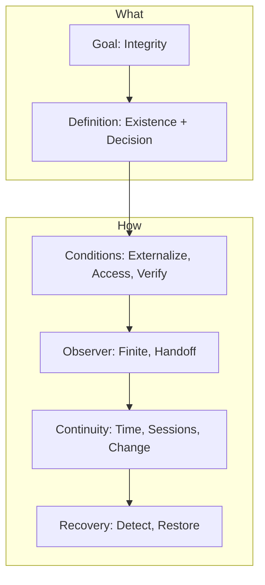

# Spec-Driven Development: Philosophy

## Overview



| Question | Section |
|----------|---------|
| What do we pursue? | 1. Integrity |
| What is it? | 2. Definition |
| What makes it possible? | 3. Conditions |
| Who maintains it? | 4. Observer |
| How does it persist? | 5. Continuity |
| What if it breaks? | 6. Recovery |

---

## 1. Integrity

A system that can be trusted. A system where every part can justify its existence and no part contradicts another.

Why integrity matters:

| Without Integrity | With Integrity |
|-------------------|----------------|
| "Why does this exist?" has no answer | Every part traces to its origin |
| Changes break things unpredictably | Changes propagate systematically |
| Knowledge lives in people's heads | Knowledge is externalized and accessible |
| AI guesses from code alone | AI follows explicit reasoning chains |

Integrity is not documentation for its own sake. It is the foundation for trustworthy systems and effective collaboration—human or AI.

---

## 2. Definition

Integrity has two dimensions:

### 2.1 Existence

Every artifact can answer: **"Why do I exist?"**

```
Design decision → derives from → Requirement → aligns to → Foundation
```

If an artifact cannot trace to its origin, it is unjustified. It may be correct, but we cannot know why.

### 2.2 Decision

Every non-obvious choice can answer: **"Why this form, not another?"**

Existence traceability alone is insufficient:

| Existence | Decision |
|-----------|----------|
| "This requirement exists because of the foundation" | "This requirement is worded this way because..." |
| "This design derives from REQ-005" | "We chose token bucket over sliding window because..." |

A system can have perfect existence links yet lose integrity if decision reasoning is lost.

### 2.3 Live Context

Integrity enables **live context**: the ability to answer "why" at any point in time, by any observer.

```
Live Context = Externalized Existence + Externalized Decisions
```

If reasoning exists only in someone's head (or a lost context window), there is no live context. The system may function, but its integrity cannot be verified.

---

## 3. Conditions

Integrity does not happen automatically. Three preconditions must be met:

### 3.1 Externalization

Everything relevant must be recorded outside the observer:

| Must Externalize | Why |
|------------------|-----|
| **Artifacts** | The "what" at each abstraction level |
| **Decisions** | The "why this choice" reasoning |
| **Assumptions** | The "given that" conditions |

**Principle:** If it is not externalized, it does not exist for integrity purposes.

What stays internal (in someone's head, in a lost session) cannot be traced, verified, or maintained.

### 3.2 Accessibility

Externalized information must be:

- **Discoverable** — can be found when needed
- **Readable** — can be understood by the observer
- **Current** — reflects actual state, not historical snapshots

Externalization without accessibility is documentation theater.

### 3.3 Verifiability

Integrity claims must be checkable:

- Links can be followed and validated
- Consistency can be tested
- Gaps can be detected

If you cannot verify integrity, you cannot trust it.

---

## 4. Observer

### 4.1 No Omniscient Observer

Traditional documentation assumes an omniscient observer who:
- Remembers all decisions ever made
- Sees the entire system at once
- Maintains consistency automatically

This observer does not exist.

In reality:
- Humans forget
- AI sessions are stateless
- Teams have partial views
- Time erodes memory

**Integrity must be maintainable by finite, forgetful, partial observers.**

### 4.2 Observer Requirements

Any observer (human or AI) must be able to:

| Capability | Enabled By |
|------------|------------|
| Recover prior reasoning | Externalized decisions |
| Verify current state | Explicit traceability links |
| Continue incomplete work | State persistence |
| Hand off to another observer | Handoff protocols |

If the system requires omniscience, it will fail.

### 4.3 Handoff

When one observer transfers work to another:

- Current state must be explicit
- Completed vs. incomplete must be clear
- Open questions must be visible
- Assumptions must be stated

Handoff applies to:
- Person → Person
- Session → Session (same AI)
- Agent → Agent (multi-agent)
- Past self → Future self

The mechanism varies. The requirement is constant.

---

## 5. Continuity

### 5.1 Across Time

Integrity at time T does not guarantee integrity at time T+1.

Threats to temporal integrity:

| Threat | Example |
|--------|---------|
| **Drift** | Small changes accumulate into inconsistency |
| **Decay** | Reasoning is forgotten, only artifacts remain |
| **Divergence** | Parallel changes create contradictions |

Integrity must be actively maintained, not assumed.

### 5.2 Across Sessions and Agents

Each session or agent has limited context. Integrity persists when:

- State is externalized before session ends
- Next session can recover full context
- No implicit dependencies on session memory

**The test:** Can a new observer, with no prior involvement, verify and continue the work using only externalized information?

### 5.3 Change Propagation

When something changes, integrity requires systematic propagation:

```
Change in Origin → Re-verify Dependents → Update or Remove
```

Propagation rules:

| Change Type | Action |
|-------------|--------|
| Addition | May require new dependents |
| Modification | Dependents must be re-verified |
| Deletion | Dependents become orphaned; must be re-justified or removed |

Change propagation is not a separate practice. It emerges from maintaining integrity over time.

---

## 6. Recovery

Integrity will break. Systems are inherited incomplete. Changes introduce inconsistencies. Sessions end abruptly. The question is not whether, but when and how to respond.

### 6.1 Detection

Broken integrity manifests as:

| Signal | Meaning |
|--------|---------|
| Orphaned artifacts | No traceable origin |
| Broken links | Origin no longer exists or contradicts |
| Missing reasoning | "Why" has no answer |
| Contradictions | Parts conflict with each other |

Detection requires active verification, not passive assumption.

### 6.2 Restoration

When integrity breaks:

1. **Isolate** — Identify the scope of breakage
2. **Trace** — Find what can still be verified
3. **Reconstruct** — Re-establish missing links or reasoning
4. **Verify** — Confirm integrity is restored

Partial integrity is better than none. Restore incrementally.

### 6.3 Inheriting Broken Systems

When you inherit a system without integrity:

- Do not assume integrity exists
- Do not invent false traceability
- Start verification from what is observable
- Build integrity forward, not backward

Pretending integrity exists is worse than admitting it does not.


